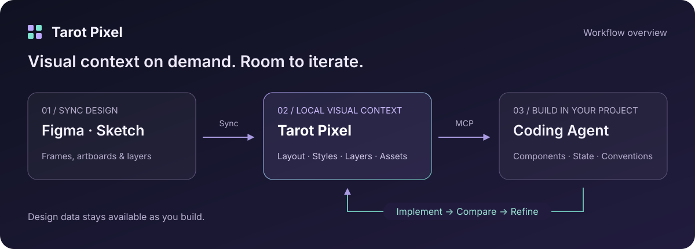

[简体中文](README.md) · **English**

# Tarot Pixel

### Help your coding agent understand designs

Turn designs into visual context your agent can query, preview, and revisit. 
Build and refine interfaces using the conventions of your project.

[Quick start](docs/en/quick-start.md) · [Design philosophy](docs/en/design-philosophy.md) · [Demos](docs/en/showcase.md) · [Feedback](https://github.com/tarot-ai-labs/tarot-pixel/issues/new/choose)

**Figma · Sketch → Tarot Pixel → Qoder / MCP clients**

## Bring visual implementation into everyday development

Building a product card involves layout, price data, button states, and existing components. Tarot Pixel supplies the visual information for that work: a design tool plugin syncs the design, a local runtime processes it, and your coding agent queries what it needs through MCP.

Start with a task like this:

> Use Tarot Pixel to implement the product card in this design: `<synced design link>`. Reuse our existing components and keep the title, price, and button dynamic. Preview the result, compare it with the design, and refine the spacing, background, and typography.

Then continue with a correction:

> The card's background corners and the spacing between the button and price differ from the design. Look up the relevant nodes and correct them using the design data.

## What you can do

| Your task                    | What Tarot Pixel provides                                                                  |
| ---------------------------- | ------------------------------------------------------------------------------------------ |
| Find a page or component     | Design overviews, module previews, layer search, and annotated node maps                   |
| Reproduce layout and styling | Dimensions, spacing, typography, styles, hierarchy, and layered D2C context                |
| Handle complex decoration    | Single-node and multi-node composites, with controls to include or exclude layers          |
| Implement different states   | Module differences that help the agent organize components alongside business requirements |
| Check the result             | Design screenshots and a local View, used with your client's page preview tools            |
| Add assets to your project   | Image assets and local font subsets that you can save into your project                    |

Your coding agent writes the implementation using your project conventions. Results depend on design data, model capabilities, client tools, and business context. Complex visuals and interactions still need verification.

## Get started

1. **Connect Tarot Pixel.** Install and enable Tarot Pixel from the [Qoder marketplace](https://qoder.com/zh/marketplace/plugin?id=tarot-pixel), or follow the [installation guide](docs/en/installation.md) to configure the public npm runtime as an MCP server.
2. **Sync a design.** Run the plugin in Figma or Sketch, select the target frames, artboards, or layers, and choose **Sync design**.
3. **Give the agent a task.** Share the complete local link returned by the sync, together with what you want to build, and implement it in your project.

For your first attempt, start with one card. [Follow the quick start →](docs/en/quick-start.md)

| Entry point    | Where to get it                                                                                                                                                |
| -------------- | -------------------------------------------------------------------------------------------------------------------------------------------------------------- |
| Figma plugin   | [Open in Figma Community](https://www.figma.com/community/plugin/1635645029043726171)                                                                          |
| Sketch plugin  | [Download the plugin ZIP](https://unpkg.com/@tarot-ai/tarot-pixel-sketch-release@latest/Tarot-Pixel.sketchplugin.zip); requires Sketch 80.0 or later           |
| Qoder plugin   | [Open in the Qoder marketplace](https://qoder.com/zh/marketplace/plugin?id=tarot-pixel); [installation instructions](docs/en/installation.md#qoder-plugin)     |
| MCP connection | [Configure the local runtime](docs/en/installation.md#configure-mcp-directly), published as [`@tarot-ai/pixel`](https://www.npmjs.com/package/@tarot-ai/pixel) |

## Why this approach

**Designs remain available as reference material.** The agent can browse an overview, locate a module, and query specific nodes. After implementation, it can return to the same design data to compare and refine the result.

**Visual context is fetched as needed.** Layout values, layer relationships, screenshots, and composites serve different purposes. The agent reads them in layers, guided by the current implementation question.

**Implementation decisions stay within your project.** Business states, APIs, component libraries, and coding conventions belong to the project context. The agent combines those constraints with the design information.

**Evaluate the whole path to delivery.** Alongside the first result, consider correction rounds, manual intervention, and the maintainability of the finished implementation.

[Read “Designs as visual reference material for coding agents” →](docs/en/design-philosophy.md)

## Demos and documentation

Demo recordings are being prepared. For now, follow the [complete workflow](docs/en/workflow.md) to try the cycle of syncing, implementing, comparing, and refining.

- [Quick start](docs/en/quick-start.md): connect, sync, and implement your first component.
- [Installation](docs/en/installation.md): design tool plugins, Qoder, and MCP configuration.
- [Workflow and prompts](docs/en/workflow.md): pages, visual corrections, component states, and assets.
- [Supported capabilities](docs/en/compatibility.md): features, requirements, and current boundaries.
- [FAQ](docs/en/faq.md): connection, sync, rendering, font, and asset troubleshooting.
- [Data and privacy](docs/en/privacy.md): local data, agent access, and sharing feedback safely.
- [Demos and examples](docs/en/showcase.md): recording slots and reproducible example details.
- [Changelog](CHANGELOG.en.md): updates to the public documentation and community resources.

## Help improve Tarot Pixel

- [Report a bug](https://github.com/tarot-ai-labs/tarot-pixel/issues/new?template=bug-report.en.yml): connection, sync, rendering, or visual implementation problems.
- [Request a feature](https://github.com/tarot-ai-labs/tarot-pixel/issues/new?template=feature-request.en.yml): explain your task and what makes it difficult today.
- [Improve the docs](https://github.com/tarot-ai-labs/tarot-pixel/issues/new?template=documentation.en.yml): missing steps, broken links, or unclear explanations.
- [Ask questions and share experiences](https://github.com/tarot-ai-labs/tarot-pixel/discussions): usage questions, examples, and open discussions.

You can submit feedback even if you do not know the version. Screenshots and logs are optional. See the [support guide](SUPPORT.en.md) for how feedback is handled.

---

This repository contains product information, documentation, and user feedback for Tarot Pixel. Software packages retain their own licensing terms; `@tarot-ai/pixel` is currently proprietary software. See [CONTRIBUTING.en.md](CONTRIBUTING.en.md) to contribute to the documentation.
