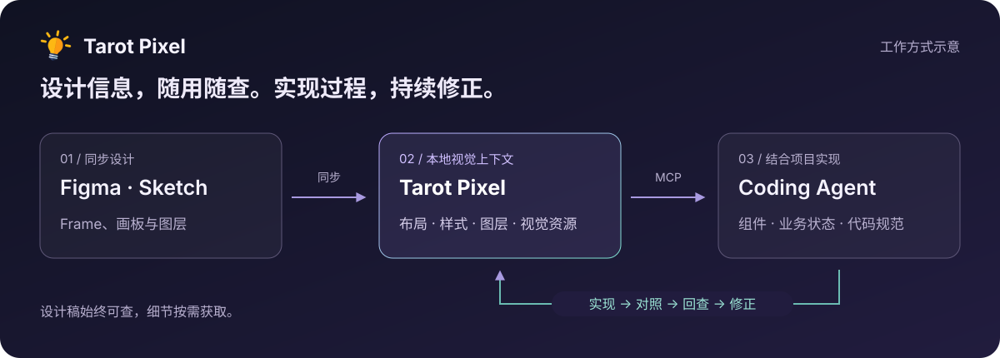

**简体中文** · [English](README.en.md)

# Tarot Pixel

### 让 AI 编程助手读懂设计稿

把设计稿变成可查询、可预览、可持续回看的视觉上下文。 
让 Coding Agent 结合你的项目，完成页面实现与视觉修正。

[快速开始](docs/quick-start.md) · [设计思考](docs/design-philosophy.md) · [演示](docs/showcase.md) · [问题反馈](https://github.com/tarot-ai-labs/tarot-pixel/issues/new/choose)

**Figma · Sketch → Tarot Pixel → Qoder / MCP 客户端**

## 把视觉还原接入真实开发

实现一个商品卡片，需要同时处理布局、价格数据、按钮状态和已有组件。Tarot Pixel 为这个过程补齐视觉信息：设计工具插件同步设计，本地 Runtime 整理数据，Coding Agent 通过 MCP 按需查阅。

你可以这样描述任务：

> 使用 Tarot Pixel 实现这个设计里的商品卡片：`<同步后的设计链接>`。复用项目现有组件，标题、价格和按钮保持可变。完成后预览页面，对照设计稿修正间距、背景和文字样式。

发现偏差后，继续对话：

> 卡片背景的圆角和设计稿不一致，按钮与价格之间的间距也不对。请回查对应节点，按设计数据修正。

## 你可以用它做什么

| 你要做的事         | Tarot Pixel 提供的信息与工具                          |
| ------------------ | ----------------------------------------------------- |
| 找到目标页面或组件 | 设计概览、模块预览、图层搜索、带节点标注的定位图      |
| 还原布局与样式     | 尺寸、间距、排版、样式和层级关系，以及分层 D2C 上下文 |
| 处理复杂装饰       | 节点与多节点合图、图层包含和排除控制                  |
| 实现不同状态       | 模块差异信息，辅助 Agent 结合业务需求组织组件         |
| 检查实现结果       | 设计截图与本地 View；配合客户端的页面预览能力回查修正 |
| 把资源用进项目     | 图片资源和本地字体子集，保存到项目后使用              |

代码实现由 Coding Agent 结合项目规范完成。效果取决于设计数据、模型能力、客户端工具和业务上下文；复杂视觉与交互仍需要验证。

## 开始使用

1. **连接 Tarot Pixel。** 从 [Qoder 插件市场](https://qoder.com/zh/marketplace/plugin?id=tarot-pixel)安装并启用 Tarot Pixel，或按[安装指南](docs/installation.md)添加公开 npm Runtime 的 MCP 配置。
2. **同步设计。** 在 Figma 或 Sketch 中运行对应插件，选择目标 Frame、画板或图层，点击“同步设计稿”。
3. **交给 Agent。** 把同步返回的完整本地链接和实现目标一起发送给 Agent，在当前项目中完成实现与预览。

第一次使用建议从一张卡片开始。[跟着快速开始完成第一次还原 →](docs/quick-start.md)

| 入口        | 获取方式                                                                                                                                |
| ----------- | --------------------------------------------------------------------------------------------------------------------------------------- |
| Figma 插件  | [在 Figma Community 中打开](https://www.figma.com/community/plugin/1635645029043726171)                                                 |
| Sketch 插件 | [下载插件 ZIP](https://unpkg.com/@tarot-ai/tarot-pixel-sketch-release@latest/Tarot-Pixel.sketchplugin.zip)，要求 Sketch 80.0 或更高版本 |
| Qoder 插件  | [在 Qoder 插件市场中打开](https://qoder.com/zh/marketplace/plugin?id=tarot-pixel)；[查看安装说明](docs/installation.md#qoder-插件)      |
| 通用 MCP    | [配置本地 Runtime](docs/installation.md#直接配置-mcp)，npm 包为 [`@tarot-ai/pixel`](https://www.npmjs.com/package/@tarot-ai/pixel)      |

## 为什么这样设计

**设计稿是一份可以反复查阅的参考资料。** Agent 可以先看概览、定位模块，再查询具体节点；实现后仍能回到同一份设计数据，继续比对和修改。

**视觉上下文按需获取。** 布局数值、图层关系、截图和合图各有用途，围绕当前实现问题逐层读取。

**实现决策留在项目里。** 业务状态、接口、组件库和代码规范属于项目上下文，Agent 把这些约束与设计信息一起用于实现。

**关注从开始到可交付的过程。** 除了首次效果，还应记录修正轮次、人工干预和最终可维护性。

[阅读《让设计稿成为 Agent 可查阅的视觉上下文》 →](docs/design-philosophy.md)

## 演示与使用文档

演示录屏正在准备中。当前可先按照[完整使用流程](docs/workflow.md)体验“同步 → 实现 → 对照 → 修正”。

- [快速开始](docs/quick-start.md)：完成第一次连接、同步和页面实现。
- [安装与连接](docs/installation.md)：设计工具插件、Qoder 和通用 MCP 配置。
- [使用流程与提示词](docs/workflow.md)：页面实现、视觉修正、多状态组件与资源处理。
- [支持范围](docs/compatibility.md)：可用能力、运行条件与当前边界。
- [常见问题](docs/faq.md)：连接、同步、截图、字体与资源问题。
- [数据与隐私](docs/privacy.md)：本地数据、Agent 使用边界与反馈脱敏。
- [演示与案例](docs/showcase.md)：录屏入口与可复现案例说明。
- [更新记录](CHANGELOG.md)：公开文档与社区入口的变化。

## 一起把它做好

遇到问题或有想法，欢迎告诉我们：

- [报告问题](https://github.com/tarot-ai-labs/tarot-pixel/issues/new?template=bug-report.yml)：连接、同步、渲染或视觉还原异常。
- [提出建议](https://github.com/tarot-ai-labs/tarot-pixel/issues/new?template=feature-request.yml)：描述你想完成的任务，以及当前遇到的困难。
- [改进文档](https://github.com/tarot-ai-labs/tarot-pixel/issues/new?template=documentation.yml)：教程遗漏、失效链接或不清楚的说明。
- [提问与交流](https://github.com/tarot-ai-labs/tarot-pixel/discussions)：使用咨询、经验分享和开放讨论。

版本不清楚也可以提交，截图和日志为选填项。处理方式见[反馈指南](SUPPORT.md)。

---

本仓库用于 Tarot Pixel 的产品介绍、使用文档和用户反馈。软件包沿用各自的授权声明；当前 `@tarot-ai/pixel` 为专有软件。文档贡献方式见 [CONTRIBUTING.md](CONTRIBUTING.md)。
