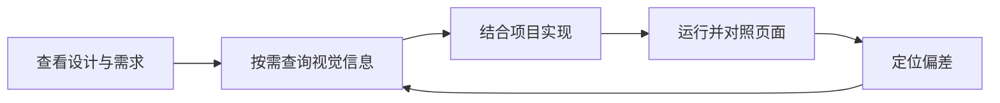

# 让设计稿成为 Agent 可查阅的视觉上下文

[返回首页](../README.md) · [体验工作流](workflow.md)

本文根据《场景营销前端 AI Coding — 视觉还原》中的产品思考整理，接入方式与能力描述以当前本地 MCP 版本为准。

## 视觉还原发生在完整开发任务中

一个商品卡片除了背景、文字和按钮，还包含价格数据、库存状态、点击行为以及项目已有的组件规范。视觉还原需要与这些工作共同完成。

Coding Agent 通常已经能够读取代码库和需求，缺少的往往是足够准确、又适合当前任务的设计信息：尺寸从哪里取，哪些图层组成背景，哪些文字需要动态变化，不同画板之间有什么关系。

Tarot Pixel 的出发点，就是为这个开发过程补齐可用的视觉上下文。实现决策由 Agent 结合业务与项目约束完成。

## 把设计稿组织成参考资料

开发者实现页面时，会先看整体，再定位组件、查看间距，写完之后重新对照。设计信息需要在整个任务期间保持可访问。

Tarot Pixel 将这份参考资料组织为设计概览、模块、节点、样式和视觉资源。Agent 可以围绕当前问题发起查询：

- 这个页面有哪些模块？
- 商品卡片对应哪些图层？
- 按钮与价格的相对位置是多少？
- 背景中的哪些装饰可以合成一张图片？
- 设计更新后，两个模块有哪些差异？

同步后的本地数据可在 Runtime 运行时反复查询；设计源文件发生修改后，需要重新同步，让后续查询基于更新后的数据。

## 上下文逐层展开

设计工具中的原始图层树保留了创作过程，可能含有复杂蒙版、重复分组、大量装饰和多个状态。实现任务通常只需要其中的一部分信息。

可以按以下层次组织读取：

| 层次       | 当前要回答的问题       | 读取的信息                   |
| ---------- | ---------------------- | ---------------------------- |
| 设计概览   | 要做哪一页、哪一块？   | 模块列表与预览               |
| 模块上下文 | 组件边界和层级是什么？ | 节点树、文本和相关结构       |
| 节点证据   | 具体数值与样式是什么？ | D2C 上下文、尺寸、间距和样式 |
| 视觉资源   | 装饰与图片怎么使用？   | 截图、资源信息与合图结果     |

简单按钮可以停留在少量节点查询；复杂卡片再展开背景和装饰层。按需读取的目标是减少无关信息，并把查询结果与当前实现决策对应起来。

这是一项信息组织原则。实际 Token 用量与耗时需要在相同任务和环境下测量，本文不据此声明固定节省比例。

## 工程提取与实现判断各有职责

| 参与方               | 主要职责                                          |
| -------------------- | ------------------------------------------------- |
| 设计工具插件         | 读取平台设计数据，处理平台差异，同步图层和资源    |
| 本地 Runtime 与 View | 存储、分析、渲染设计，通过 MCP 提供查询与资源工具 |
| Coding Agent         | 结合项目选择组件结构、样式方式、资源和业务实现    |
| 开发者               | 表达需求与约束，检查关键效果和交付结果            |

有明确数据的尺寸和样式应从设计中读取。组件拆分、动态内容、交互与状态则需要结合项目判断。例如卡片的光效背景可以合图，价格与按钮仍应作为动态内容实现。

不同设计平台保留各自的解析方式；统一的查询入口承接这些结果。这样既能保留设计工具的特点，也能让 Agent 在项目中使用一致的工作方法。

## 修正能力属于工作流的一部分

开发者说“这里的间距不对”时，Agent 应能定位相关节点、查询数值、修改代码并再次预览。设计信息始终可查，才有条件把修正建立在证据上。

页面预览、浏览器操作和代码执行由客户端及项目工具提供。Tarot Pixel 提供设计侧的数据和视觉资源，整个闭环需要这些能力配合完成。

## 如何判断它是否有帮助

除了第一张截图的效果，更值得记录的是从开始到可交付的全过程：

- 首次实现有哪些遗漏，最后是否修正。
- 人工介入了多少次，每次是在澄清需求、补充信息还是纠正实现。
- 查询、资源处理、实现与验证分别耗费多少时间。
- 生成的组件是否保留业务状态，是否复用了项目规范。
- 设计更新后，已有实现是否容易调整。

记录时保留客户端、模型、插件版本、视口、字体条件和任务范围，区分首次结果与修正后的结果。当前公开仓库尚未发布可复现的统一测评数据。

## 当前版本与后续方向

当前本地版本通过 MCP 提供读取、分析和渲染能力。节点定位图用于标注节点；模块差异用于辅助分析；这些信息仍需要 Agent 结合任务进行判断。

原文讨论过的通用 REST 查询、内置 Chat 视觉 Agent、图片反查节点以及交互式 TUI，不属于本指南承诺的本地 MCP 功能。当前准确范围见[支持范围](compatibility.md)。

值得继续探索的方向包括复杂图层定位、装饰与内容的边界判断、多状态组件的辅助分析，以及更可复现的视觉修正案例。具体优先级会结合真实使用反馈评估，不在此承诺交付时间。
