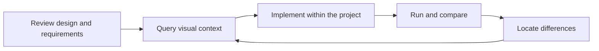

# Designs as visual reference material for coding agents

[简体中文](../design-philosophy.md) · **English**

[Home](../../README.en.md) · [Try the workflow](workflow.md)

This article adapts the product ideas in the [original WeChat article, in Chinese](https://mp.weixin.qq.com/s?__biz=MzAxNDEwNjk5OQ==&mid=2650544417&idx=1&sn=b464075a0ff3f06d98f1919331b6b7ff&chksm=8390d139b4e7582f6f76fd1769393679c81e51080b44d8851361364570005e2403ab8acc3ce2#rd). Connection methods and capabilities here reflect the current local MCP version.

## Visual implementation is part of a complete development task

A product card includes a background, text, and buttons, alongside price data, inventory states, click behavior, and the project's component conventions. Its visual implementation needs to be developed with those concerns.

A coding agent can usually read the codebase and requirements. What it often lacks is accurate design information suited to the task: where to find dimensions, which layers form the background, which text must remain dynamic, and how different artboards relate to one another.

Tarot Pixel supplies visual context for this development process. The agent makes implementation decisions using both business requirements and project constraints.

## Organize designs as reference material

Developers move from the overall design to individual components and spacing details, then compare the implementation with the original. Design information needs to remain accessible throughout the task.

Tarot Pixel organizes this reference material into design overviews, modules, nodes, styles, and visual assets. The agent can query it around the question at hand:

- Which modules does this page contain?
- Which layers belong to the product card?
- What is the button's position relative to the price?
- Which background decorations can be combined into one image?
- What differs between these two modules after a design update?

Synced local data can be queried repeatedly while the runtime is running. When the source design changes, sync it again so subsequent queries use the updated data.

## Reveal context in layers

A design tool's layer tree preserves the creative process. It may include complex masks, repeated groups, many decorative layers, and multiple states. An implementation task usually needs only part of that information.

Queries can follow these layers:

| Layer           | Question to answer                               | Information to retrieve                               |
| --------------- | ------------------------------------------------ | ----------------------------------------------------- |
| Design overview | Which page or region should I build?             | Module lists and previews                             |
| Module context  | What are the component boundaries and hierarchy? | Node trees, text, and surrounding structure           |
| Node evidence   | What are the exact values and styles?            | D2C context, dimensions, spacing, and styles          |
| Visual assets   | How should decoration and images be used?        | Screenshots, asset information, and composite results |

A simple button may require only a few node queries. A complex card may need additional background and decoration details. Reading on demand aims to reduce irrelevant information and connect each query to an implementation decision.

This is a principle for organizing information. Token use and elapsed time need measurement under equivalent tasks and environments; this article makes no claim of a fixed reduction.

## Data extraction and implementation judgment have distinct responsibilities

| Participant            | Main responsibility                                                                         |
| ---------------------- | ------------------------------------------------------------------------------------------- |
| Design tool plugin     | Read platform design data, handle platform differences, and sync layers and assets          |
| Local runtime and View | Store, analyze, and render designs; expose queries and asset tools through MCP              |
| Coding agent           | Choose component structure, styling, assets, and business implementation within the project |
| Developer              | Express requirements and constraints, then review important behavior and delivery results   |

Dimensions and styles with explicit design values should be read from the data. Component boundaries, dynamic content, interactions, and states need project context. For example, a card's lighting effects can become a composite image while its price and button remain dynamic elements.

Each design platform retains its own parsing logic. A common query interface makes the results available to the agent while preserving platform differences.

## Refinement belongs in the workflow

When a developer says “the spacing is wrong here,” the agent should be able to locate the relevant nodes, read their values, update the code, and preview it again. Keeping the design accessible makes it possible to ground those corrections in evidence.

The client and project tools provide page previews, browser interaction, and code execution. Tarot Pixel supplies the design data and visual assets. Completing this cycle requires those capabilities to work together.

## How to evaluate its usefulness

Alongside the first screenshot, record the path from the initial task to a usable implementation:

- What was missing from the first result, and whether it was corrected.
- How often a person intervened, and whether each intervention clarified requirements, supplied information, or corrected the implementation.
- Time spent querying designs, handling assets, implementing, and verifying.
- Whether the generated components preserve business states and follow project conventions.
- How easily the implementation can adapt to a design update.

Record the client, model, plugin versions, viewport, font conditions, and task scope. Distinguish the first result from the corrected result. This public repository has not yet published a reproducible, standardized benchmark.

## Current version and future directions

The local version provides reading, analysis, and rendering through MCP. Node maps annotate nodes, and module differences support analysis. The agent still needs to interpret that information in the context of its task.

The original article also explored general REST queries, an embedded visual Chat Agent, reverse image lookup for nodes, and an interactive TUI. Those are outside the capabilities described for this local MCP version. See [supported capabilities](compatibility.md) for the current scope.

Areas for further exploration include locating layers in complex designs, distinguishing decoration from content, assisting with component states, and publishing reproducible visual refinement examples. Priorities will be evaluated using actual feedback; no delivery dates are promised here.
